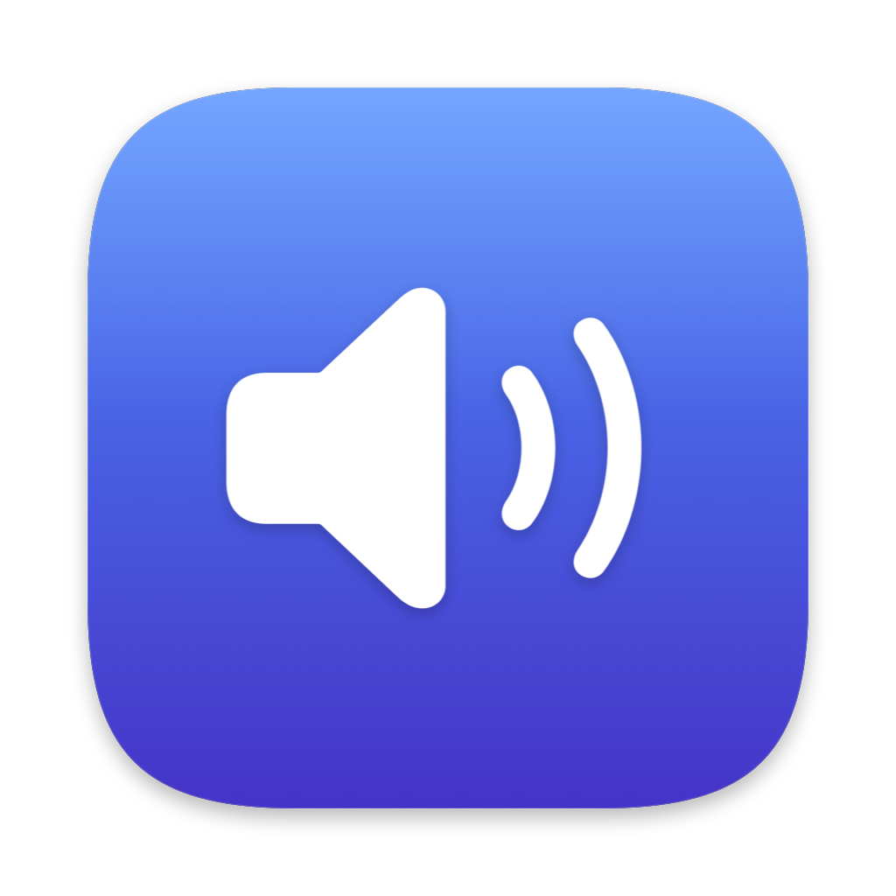
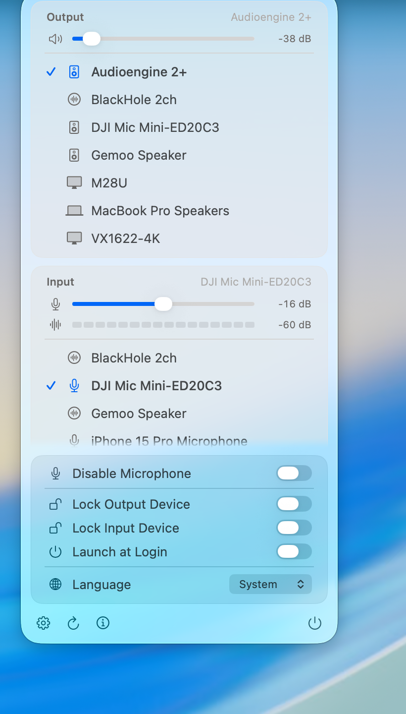

<div align="center">



# AudioSwitch

[](https://ko-fi.com/H2T024VDBG)

**Switch macOS audio devices from the menu bar.**

Native, Apple Silicon, zero dependencies. English · 简体中文 · 繁體中文



</div>

---

macOS buries input device switching several clicks deep in System Settings, and
the built-in volume menu only covers output. AudioSwitch puts both in one panel:
every input and output device, a volume slider and mute for each, a live
microphone level meter, and a one-click switch — without opening System
Settings.

## Features

**Devices**

- Every input and output device in one panel, each with an icon for *the kind of
  device it is* — AirPods (and Pro/Max), headphones, hi-fi speaker, your Mac's
  own speakers, display, microphone, virtual device — the way the system
  Bluetooth menu does, rather than one glyph per connection type.
- The list matches System Settings → Sound exactly, because it filters on the
  same CoreAudio property the system uses
  (`kAudioDevicePropertyDeviceCanBeDefaultDevice`). Virtual devices the system
  hides stay hidden here too.
- Switching the output also moves the *system alert* output, so notification
  sounds follow the device instead of staying on the old one.
- **Right-click the menu bar icon** to cycle to the next output device without
  opening the panel.

**Volume and levels**

- A volume slider and mute button per direction, with the level in dB.
- A **live input level meter** so you can see whether your microphone is
  actually picking you up. The microphone is only tapped while the panel is
  open — the app never holds it in the background.
- The menu bar icon tracks the output level using SF Symbols' variable-value
  rendering, exactly as the system volume icon does.
- Volume changed anywhere else (volume keys, System Settings, another app)
  updates the panel and the icon immediately.

**Privacy and convenience**

- **Disable Microphone** — a hard off switch. Mutes the current input device
  system-wide, re-mutes whichever device becomes default later, and survives a
  reboot. Devices with no mute switch get their gain zeroed instead.
- **Lock Output / Input Device** — pins the chosen device. If another app grabs
  it (conferencing apps are the usual offender), it is switched straight back.
  Stored by device UID, so it survives unplugging and reboots.
- **Launch at Login**, **Sound Settings…** (⌘,), **Refresh** (⌘R), **Quit** (⌘Q).
- Interface language: English, 简体中文, 繁體中文, or follow the system.
- **Automatic updates** via Sparkle — checked daily in the background, with the
  download authenticated by an EdDSA signature before anything is installed.

## Install

Download the latest `AudioSwitch.zip` from
[Releases](https://github.com/iamzifei/audioswitch/releases/latest), unzip, and
drag `AudioSwitch.app` to `/Applications`.

> **First launch.** Releases are signed with a Developer ID and, once
> notarised, open normally. If you get "cannot be opened because the developer
> cannot be verified", the build you downloaded was not notarised —
> **right-click the app → Open**, then confirm. You only need to do this once.

The icon appears in the menu bar — there is no Dock icon and no window.

**If you use a menu bar manager** (Ice, Bartender, Hidden Bar), it may hide the
new icon automatically. Open its settings and move AudioSwitch to the visible
section.

**Microphone access** is requested the first time you open the panel. It powers
the input level meter only — audio is measured, never recorded or stored. The
app works fine if you decline; the meter just stays empty.

## Build from source

Requires macOS 14+ and Xcode's Swift toolchain.

```bash
git clone https://github.com/iamzifei/audioswitch.git
cd audioswitch
./build.sh --install     # test → build → render icon → bundle → sign → /Applications
```

`./build.sh` alone builds `AudioSwitch.app` in the project directory without
installing it. It is ad-hoc signed by default, which is fine for running on the
machine that built it.

### Releasing a signed build

```bash
# One-time: store notary credentials in the keychain
xcrun notarytool store-credentials audioswitch \
  --apple-id <apple-id> --team-id <TEAMID> --password <app-specific-password>

CODESIGN_IDENTITY="Developer ID Application: … (TEAMID)" \
NOTARY_PROFILE=audioswitch \
./release.sh 1.3.0
```

`release.sh` bumps the bundle version, builds with the hardened runtime and the
microphone entitlement, zips, notarises, staples the ticket, regenerates the
Sparkle `appcast.xml` with a fresh EdDSA signature, and reports what Gatekeeper
will make of the result. Without `NOTARY_PROFILE` it still produces a signed
build, but users get the "unidentified developer" prompt on first launch.

The appcast has to be committed to `main` before any installed copy will see
the update — that URL is what `SUFeedURL` in Info.plist points at.

The first release from a new machine blocks on a keychain authorisation dialog,
because `sign_update` needs the EdDSA private key. Choose **Always Allow** and
subsequent releases run unattended.

### Releasing from CI

Pushing a `vX.Y.Z` tag runs `.github/workflows/release.yml`, which does all of
the above on a runner and commits the regenerated appcast back to `main`. It
needs these repository secrets:

| Secret | What it is |
| --- | --- |
| `MACOS_CERT_P12_BASE64` | base64 of the Developer ID Application `.p12` export |
| `MACOS_CERT_PASSWORD` | password protecting that `.p12` |
| `APPLE_ID` | Apple ID used for notarisation |
| `APPLE_ID_PASSWORD` | app-specific password for that Apple ID |
| `APPLE_TEAM_ID` | 10-character Apple Developer Team ID |
| `SPARKLE_ED_PRIVATE_KEY` | Sparkle EdDSA private key (`generate_keys -x`) |

## Tests

```bash
swift test
```

73 tests covering device filtering and System-Settings parity, per-device icon
resolution, volume/dB conversion, menu bar symbol behaviour, level metering
maths, and settings persistence. The integration tests run against the real
CoreAudio server but never change your active device or its volume — the write
path is exercised by re-selecting the device that is already default.

## Known limits

**AirPlay targets are not listed.** System Settings → Sound shows AirPlay
speakers alongside local devices. They are not reachable through public APIs: a
full CoreAudio enumeration returns no AirPlay devices at all, because macOS only
instantiates one after it has been selected. The system panel gets that list
from a private framework. Use **Sound Settings…** in the panel to pick an
AirPlay target; once it is active it appears in AudioSwitch like any other
device.

## How it works

```
Sources/AudioSwitchCore/     CoreAudio layer (testable, no UI)
  CoreAudioProperty.swift    typed wrappers over AudioObjectGet/SetPropertyData
  AudioDevice.swift          device model, per-device icon resolution
  VolumeController.swift     volume / mute read + write, dB conversion
  AudioDeviceManager.swift   enumeration, switching, locking, hot-plug listeners
  InputLevelMeter.swift      live microphone metering via AVAudioEngine
  Preferences.swift          UserDefaults storage + SMAppService login item
Sources/AudioSwitch/         menu bar shell
  main.swift                 NSApplication entry, .accessory activation policy
  AppDelegate.swift          NSStatusItem + NSPopover host, menu bar glyph
  DevicePanel.swift          SwiftUI panel
  AboutPage.swift            about + update status
  Localization.swift         runtime language switching
  Updater.swift              Sparkle auto-update wrapper
  AppMetadata.swift          repository / version constants
scripts/
  update_appcast.py          rewrites appcast.xml for one release
packaging/
  Info.plist                 LSUIElement bundle metadata
  make_icon.swift            draws AppIcon.icns (Apple squircle geometry)
```

### Notes from building it

A few things that were not obvious, kept here because they cost real debugging
time:

**SwiftUI's `MenuBarExtra` never registered a status item** on macOS 26 — the
process ran, no status item was created, no error was raised. `NSStatusItem`
works, and it also allows intercepting right-clicks, which `MenuBarExtra` does
not expose.

**`kAudioDevicePropertyVolumeDecibels` is unreliable.** One USB DAC at 12.5%
volume reported `1.38e-30` dB from it, inside a stated range of -40…0 dB, which
renders as "0 dB" next to a slider near the bottom. Decibels are derived from
`kAudioDevicePropertyVolumeScalarToDecibels` instead, so the number and the
slider can never disagree.

**Subscribe to `@Published` values, not `objectWillChange`.** The latter fires
*before* the property updates, so the menu bar icon lagged one change behind and
looked like it only reacted to large volume jumps.

**The menu bar glyph is padded to a constant width.** `speaker.wave.1/2/3` are
three different widths; swapping between them made the status item — and every
icon to its left — shift sideways. One variable-value `speaker.wave.3.fill`
solves both the width and the granularity.

**SwiftPM lowercases `.lproj` directory names** in its resource bundle:
`zh-Hans.lproj` ships as `zh-hans.lproj`. Looking up only the canonical spelling
silently falls back to the base language.

**The app icon is drawn in code** (`packaging/make_icon.swift`) rather than
exported from a design tool, so it follows Apple's template exactly: 1024pt
canvas, 824pt art area, 185.4pt continuous-curvature corners, every iconset size
rasterised from vectors instead of resampled.

### Verifying UI changes

A transient popover closes the instant any screenshot tool takes focus, so the
panel cannot be captured normally:

```bash
# Render the panel straight to a PNG and exit
AUDIOSWITCH_RENDER_PANEL=/tmp/panel.png AudioSwitch.app/Contents/MacOS/AudioSwitch

# Pick a language, or render the About page
AUDIOSWITCH_RENDER_LANG=simplifiedChinese AUDIOSWITCH_RENDER_ABOUT=1 ...

# Or run with a panel that does not close when focus moves away
AUDIOSWITCH_STICKY_PANEL=1 AudioSwitch.app/Contents/MacOS/AudioSwitch
```

`ImageRenderer` cannot draw AppKit-backed controls, so sliders and switches
appear as placeholders in rendered PNGs; everything else is accurate.

## Also by the same author

**[ClipStack](https://github.com/iamzifei/clipstack)** — a macOS menu bar
clipboard history manager. ⇧⌘V brings up a searchable panel of everything you
have copied, with a full preview pane; pressing return copies it back. Built to
pair with Claude Code's clipboard-delivery workflow, where several snippets get
copied in sequence and you need all of them, not just the last one. Same
approach: native Apple Silicon, zero third-party dependencies.

## License

MIT — see [LICENSE](LICENSE).

Made by [James](https://github.com/iamzifei).
