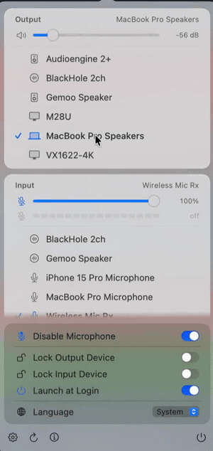

<div align="center">


# AudioSwitch

[](https://ko-fi.com/H2T024VDBG)

**在 macOS 菜单栏里切换音频设备。**

原生、Apple Silicon、零依赖。界面支持 English · 简体中文 · 繁體中文

[**audioswitch.dev**](https://audioswitch.dev) · **中文** · [English](README.en.md)

&nbsp;&nbsp;

<sub>▶ 完整演示（约 1 分钟）在 <a href="https://audioswitch.dev">audioswitch.dev</a></sub>

</div>

---

macOS 把输入设备的切换埋在系统设置好几层之下，而菜单栏自带的音量菜单只管输出。
AudioSwitch 把两边放进同一个面板：所有输入和输出设备、各自的音量滑块与静音、
实时麦克风电平表，点一下就切完，不用再打开系统设置。

## 功能

**设备**

- 所有输入和输出设备在同一个面板里，每个都带**按设备类型区分的图标** ——
  AirPods（含 Pro / Max）、耳机、音箱、你 Mac 自己的扬声器、显示器、麦克风、
  虚拟设备 —— 和系统蓝牙菜单的做法一致，而不是一种连接方式一个图标。
- 列表与「系统设置 → 声音」**完全一致**，因为用的是系统同一个判据
  （`kAudioDevicePropertyDeviceCanBeDefaultDevice`）。系统不显示的虚拟设备，
  这里同样不显示。
- 切换输出时会一并切换**系统提示音**的输出，通知声跟着设备走，不会留在旧设备上。
- **右键点击菜单栏图标**可以直接跳到下一个输出设备，不用展开面板。

**音量与电平**

- 输入、输出各有一条音量滑块和静音按钮，数值以 dB 显示。
- **实时麦克风电平表**，一眼看出麦克风到底有没有收到你的声音。
  只在面板打开时占用麦克风，关掉即释放，不会常驻。
- 菜单栏图标跟随输出音量变化，用的是 SF Symbols 的 variable value 渲染 ——
  和系统音量图标完全相同的机制。
- 输出切到耳机时，菜单栏图标换成对应的耳机字形（AirPods / AirPods Pro /
  AirPods Max / Beats / 通用耳机），一眼就知道声音去了头上还是房间里。
  静音时仍然显示带斜杠的喇叭——「听不见」比「戴着什么」更要紧。
- 在别处改音量（音量键、系统设置、其他 app），面板和图标即时跟随。

**隐私与便利**

- **停用麦克风** —— 一个硬开关。系统级静音当前输入设备，之后成为默认的设备也会
  被自动重新静音，重启后依然保持。设备若没有静音开关，则改为把增益归零。
- **锁定输出 / 输入设备** —— 把选定设备钉住。别的 app（会议软件是常见元凶）
  抢走它，会被立刻切回来。按设备 UID 记录，拔插和重启都不失效。
- **登录时启动**、**声音设置…**（⌘,）、**刷新**（⌘R）、**退出**（⌘Q）。
- 界面语言：English、简体中文、繁體中文，或跟随系统。
- **自动更新**（基于 Sparkle）—— 每天后台检查，下载包经 EdDSA 签名验证后才会安装。

## 安装

到 [Releases](https://github.com/iamzifei/audioswitch/releases/latest) 下载
`AudioSwitch.zip`，解压后把 `AudioSwitch.app` 拖进 `/Applications`。

发布版经过 Developer ID 签名与 Apple 公证，**双击即可打开**，不需要右键→打开，
也不用改 `xattr`。

图标出现在菜单栏 —— 没有 Dock 图标，也没有窗口。

**如果你在用菜单栏管理工具**（Ice、Bartender、Hidden Bar），它可能会自动把新图标
折叠隐藏。打开它的设置，把 AudioSwitch 移到可见区即可。

**麦克风权限**在你第一次打开面板时申请，只用于电平表 —— 音频只做测量，
不录制也不保存。拒绝也不影响使用，只是电平表一直是空的。

## 从源码构建

需要 macOS 14 以上和 Xcode 的 Swift 工具链。

```bash
git clone https://github.com/iamzifei/audioswitch.git
cd audioswitch
./build.sh --install     # 测试 → 构建 → 生成图标 → 打包 → 签名 → /Applications
```

只跑 `./build.sh` 则在项目目录里生成 `AudioSwitch.app`，不安装。默认 ad-hoc 签名，
在构建它的机器上跑够用。

### 发布正式版

```bash
# 一次性：把公证凭据存进钥匙串
xcrun notarytool store-credentials audioswitch \
  --apple-id <apple-id> --team-id <TEAMID> --password <app 专用密码>

CODESIGN_IDENTITY="Developer ID Application: … (TEAMID)" \
NOTARY_PROFILE=audioswitch \
./release.sh 1.4.0
```

`release.sh` 会依次完成：版本号递增、以 hardened runtime 和麦克风 entitlement 构建、
打包、公证、staple 票据、用新签名重新生成 Sparkle 的 `appcast.xml`，
最后报告 Gatekeeper 的判定结果。不带 `NOTARY_PROFILE` 也能产出签名版本，
但用户首次打开会看到「无法验证开发者」。

**appcast 必须先提交到 `main`**，已安装的副本才看得到更新 ——
Info.plist 里的 `SUFeedURL` 指向的就是那个地址。

新机器上第一次发布会卡在钥匙串授权对话框上，因为 `sign_update` 需要读 EdDSA 私钥。
选「**始终允许**」，之后就能无人值守地跑。

### 用 CI 发布

推送 `vX.Y.Z` 标签会触发 `.github/workflows/release.yml`，在 runner 上完成上述全部
步骤，并把重新生成的 appcast 提交回 `main`。需要这些仓库 secrets：

| Secret | 是什么 |
| --- | --- |
| `MACOS_CERT_P12_BASE64` | Developer ID Application 证书导出的 `.p12` 的 base64 |
| `MACOS_CERT_PASSWORD` | 保护该 `.p12` 的密码 |
| `APPLE_ID` | 用于公证的 Apple ID |
| `APPLE_ID_PASSWORD` | 该 Apple ID 的 app 专用密码 |
| `APPLE_TEAM_ID` | 10 位 Apple Developer Team ID |
| `SPARKLE_ED_PRIVATE_KEY` | Sparkle 的 EdDSA 私钥（`generate_keys -x` 导出） |

## 测试

```bash
swift test
```

83 个测试，覆盖设备过滤与「系统设置」一致性、按设备类型的图标推断、音量与 dB 转换、
菜单栏图标行为（含耳机字形接管）、电平计算，以及设置持久化。集成测试跑在真实的 CoreAudio 上，
但**不会改动你正在用的设备或音量** —— 写入路径是通过「重新选中已经是默认的那个设备」
来验证的。

## 已知限制

**不列出 AirPlay 设备。**「系统设置 → 声音」会把 AirPlay 音箱和本地设备列在一起，
但公开 API 拿不到它们：完整枚举 CoreAudio 返回的设备里没有任何一个是 AirPlay，
因为 macOS 只在你选中之后才会实例化 AirPlay 设备。系统面板那份列表来自私有框架。
需要用 AirPlay 时，点面板里的**声音设置…**去选；选中之后它就会像普通设备一样
出现在 AudioSwitch 里。

## 实现

```
Sources/AudioSwitchCore/     CoreAudio 层（可测试，无 UI）
  CoreAudioProperty.swift    AudioObjectGet/SetPropertyData 的类型化封装
  AudioDevice.swift          设备模型、按设备类型的图标推断
  VolumeController.swift     音量 / 静音读写、dB 换算
  MenuBarIcon.swift          菜单栏字形选择（耳机 vs 喇叭、静音）
  AudioDeviceManager.swift   枚举、切换、锁定、热插拔监听
  InputLevelMeter.swift      基于 AVAudioEngine 的实时麦克风电平
  Preferences.swift          UserDefaults 存储 + SMAppService 登录项
Sources/AudioSwitch/         菜单栏外壳
  main.swift                 NSApplication 入口，.accessory 激活策略
  AppDelegate.swift          NSStatusItem + NSPopover 宿主、菜单栏图标
  DevicePanel.swift          SwiftUI 面板
  AboutPage.swift            关于页与更新状态
  Localization.swift         运行时语言切换
  Updater.swift              Sparkle 自动更新封装
  AppMetadata.swift          仓库 / 版本常量
docs/                        落地页（GitHub Pages → audioswitch.dev）
  index.html                 单页站点，纯静态、无外部请求
  hero.mp4 / demo.gif        面板录屏（ChatCut 剪辑）
packaging/
  Info.plist                 LSUIElement 包元数据
  make_icon.swift            绘制 AppIcon.icns（Apple squircle 几何）
scripts/
  update_appcast.py          为单次发布重写 appcast.xml
```

### 界面

按 macOS 26 的设计语言来做，和控制中心同一套：半透明卡片分组浮在弹出面板自身的
Liquid Glass 材质上、全程 continuous（squircle）圆角、持久设置用真开关、
底部一条紧凑的图标命令条。所有颜色都用语义色
（`.primary`/`.secondary`/`.accentColor`/`.separator`/`.selection`），
浅色模式、深色模式和强调色变化交给系统处理，不写死任何一个值。

### 踩过的坑

几个不显然、且实打实花了调试时间的点：

**SwiftUI 的 `MenuBarExtra` 在 macOS 26 上根本没注册 status item** —— 进程在跑、
没有 status item、也没有任何报错。换成 `NSStatusItem` 就正常，而且它还能拦截右键，
这是 `MenuBarExtra` 不提供的。

**`kAudioDevicePropertyVolumeDecibels` 不可靠。** 一台 USB DAC 在 12.5% 音量下，
从这个属性读到的是 `1.38e-30` dB —— 而它自报的范围是 -40…0 dB。渲染出来就是
「0 dB」，而滑块明明在底部。现在 dB 一律由
`kAudioDevicePropertyVolumeScalarToDecibels` 换算得出，数字和滑块位置不可能再打架。

**要订阅 `@Published` 的值，不要订阅 `objectWillChange`。** 后者在属性更新**之前**
触发，于是菜单栏图标永远慢一拍，表现出来像是「只有大幅调音量才会变」。

**菜单栏字形要垫到固定宽度。** `speaker.wave.1/2/3` 是三个不同宽度的符号，
来回切换会让 status item —— 连同它左边所有图标 —— 横向漂移。
改用单个 variable value 的 `speaker.wave.3.fill`，宽度和档位粒度两个问题一起解决。

**SwiftPM 会把 `.lproj` 目录名转成小写**：源码里的 `zh-Hans.lproj` 打进资源包后
变成 `zh-hans.lproj`。只按原始拼写查找会静默回退到基础语言，不报任何错。

**hardened runtime 会拦掉麦克风。** 必须显式声明
`com.apple.security.device.audio-input` entitlement，否则电平表**收不到任何信号**
—— 而且 ad-hoc 签名时一切正常，一换成 Developer ID 就坏。

**应用图标是用代码画的**（`packaging/make_icon.swift`），而不是从设计工具导出，
这样能严格符合 Apple 的模板：1024pt 画布、824pt 图形区、185.4pt 连续曲率圆角，
每个尺寸都从矢量重新光栅化，而不是缩放位图。

### 验证界面改动

弹出面板是 transient 的，任何截图工具一夺取焦点它就关闭，所以没法正常截图：

```bash
# 直接把面板渲染成 PNG 后退出
AUDIOSWITCH_RENDER_PANEL=/tmp/panel.png AudioSwitch.app/Contents/MacOS/AudioSwitch

# 指定语言，或渲染关于页
AUDIOSWITCH_RENDER_LANG=simplifiedChinese AUDIOSWITCH_RENDER_ABOUT=1 ...

# 或者让面板在失去焦点时不关闭
AUDIOSWITCH_STICKY_PANEL=1 AudioSwitch.app/Contents/MacOS/AudioSwitch
```

`ImageRenderer` 画不了 AppKit 支撑的控件，所以渲染出的 PNG 里滑块和开关是占位块，
其余部分是准确的。

## 同系列

**[Candela](https://getcandela.app)** —— macOS 藏起来的显示器控制，全都放进一个菜单栏面板：
通过 DDC 调外接屏的真实亮度、清晰的 HiDPI 缩放、在每一块屏幕上都好使的亮度键，
还有跨屏同步和预设。免费、开源，没有 Pro 版也没有序列号。

**[ClipStack](https://github.com/iamzifei/clipstack)** —— macOS 菜单栏剪贴板历史管理器。
⇧⌘V 呼出一个可搜索的面板，列出你复制过的所有内容，右侧带完整预览，回车即粘回。
为配合 Claude Code 的剪贴板交付流程而写 —— 那种场景下会连续复制好几段，
而你需要的是全部，不只是最后一段。同样是原生 Apple Silicon、零第三方依赖。

## 许可

MIT，见 [LICENSE](LICENSE)。

由 [James](https://github.com/iamzifei) 制作。
